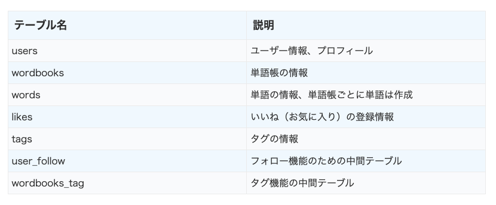

## Webサービスの紹介
単語帳を作って学習ができるオリジナルWebサービス 「タンシェル」：  
https://www.tansheru.com/

単語帳（暗記カード）は学生時代などに使用されたことがある人多いかと思います。  
英単語などを書き留めて、ペラペラめくって学習するツールです。  
この単語帳をパソコンやスマホ、タブレットからいつでも作成・学習するためのWebサービスとなります。

また、特徴として他のユーザと単語帳が共有できます。  
単語帳は、学校のテスト、試験が終わると用が無くなって破棄するだけになります。  
しかし、他に必要な人、欲しい人が必ずいるので、共有して使えるようにしてはどうかと思いました。  
単語帳自体のWebサービス、アプリは色々ありますが、「共有する」という特徴を持たせました。  
そのため、Webサービスの名前は「単語（帳）をつくる」、「共有（シェア）する」で「タンシェル」としました。

## HOME画面
HOME画面からは自身で作成した単語帳やフォローした他のユーザの単語帳が並ぶようになっています。他のユーザの単語帳はそのユーザをフォローすることでHOME画面に表示されます。  

## 学習画面
登録した単語と答えを上下に分けて表示しています。  
解答を確認する際は左へスライドします。  

解答の表示方法は少し悩みましたが、スライド表示にしました。  
当初はクリックでパッと解答が見れるようにしていましたが、実際の単語帳を使用する際は、ちょっとめくったり、解答の頭文字だけ見たりとかすると思うので、できるだけそういった使い方に近い動作にしたかったというのが理由です。

## 機能一覧
* 単語帳/単語 登録  
* 単語帳/単語 管理機能  
  * 編集  
  * 削除  
* 単語帳学習機能  
  * 登録順出題  
  * ランダム出題  
* いいね機能  
  * いいね（お気に入り）登録/削除  
  * いいね（お気に入り）一覧表示  
* タグ機能  
  * タグ登録/削除  
  * 同一タグの単語帳表示  
* ユーザ機能  
  * ユーザ登録、ログイン、ログアウト  
  * 他ユーザのフォロー／アンフォロー  
  * パスワード再設定  
  * プロフィール設定（画像アップロード）  

レスポンシブ対応  
Webサービスの性質上、外で使うことが多いと思われるため、スマホ表示にも対応しています。

## 使用技術
* HTML  
* CSS  
* JavaScript  
* Bootstrap 5.1.3  
* Vue.js 2.6.14 ※  
* PHP 7.3.29  
* Laravel 6.20.28  
* MySQL 5.7.29  
* git 2.24.3  
* MailHog(開発環境)/SendGrid(本番環境)  
* VSCode  

※Vue.jsはタグ、プロフィール設定の画像アップロード、学習画面の解答スライド表示、いいね（お気に入り）機能で利用しています。

## DB設計

テーブル一覧  

